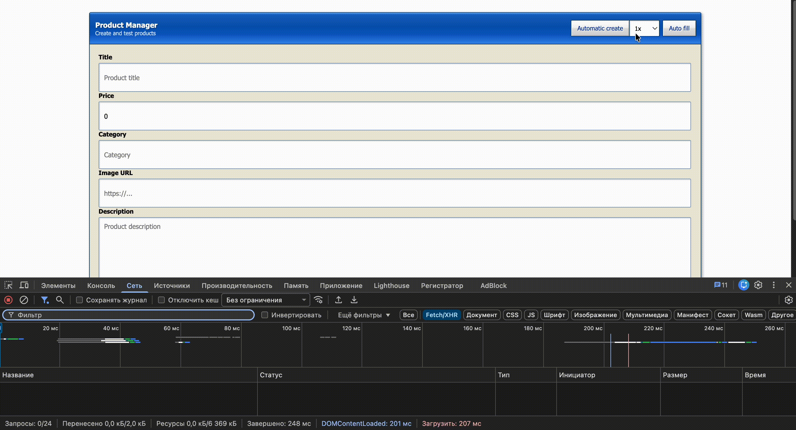
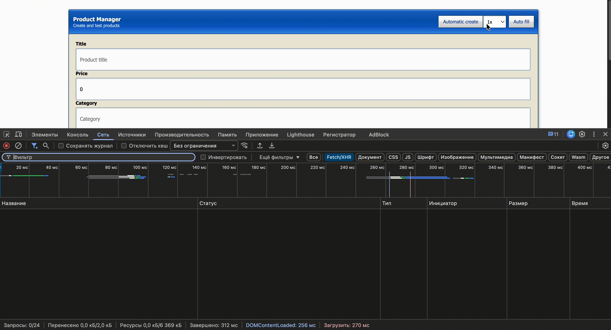
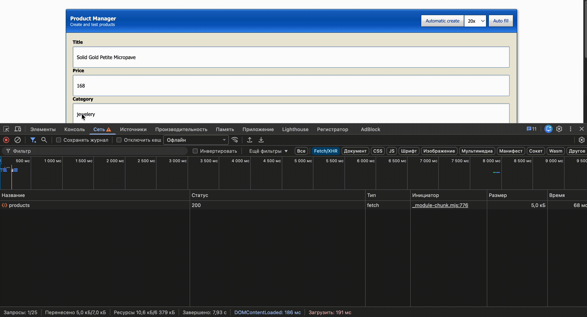

# ngx-offline-sync

<div>
  
  <a href="https://www.npmjs.com/package/ngx-offline-sync">
    
  </a>
  
</div>

**Documentation:** English · [Русский](docs/ru/README.md) · [日本語](docs/ja/README.md)

> **Offline-first HTTP request synchronization for Angular.**

`ngx-offline-sync` is an open-source Angular library designed to keep HTTP requests safe when the network connection is temporarily unavailable.

When the application goes offline, supported HTTP requests are automatically added to a local queue and persisted in **IndexedDB**. Once the connection is restored, the library automatically starts synchronization and processes the queued requests.

You don't need to build your own request queue, manage IndexedDB, or implement network recovery logic — `ngx-offline-sync` handles the synchronization infrastructure while keeping the familiar Angular `HttpClient` API.

## How it works

### Online

<p align="center">
  
</p>

When an internet connection is available, requests are sent normally through Angular's `HttpClient`.

### Offline

<p align="center">
  
</p>

When the connection is unavailable, supported requests are not lost. They are persisted locally and added to the pending queue.

### Connection restored

<p align="center">
  
</p>

Once the connection is restored, the library automatically starts processing the queue and synchronizes the stored requests.

## Features

* **Automatic request queueing** — supported HTTP requests are automatically queued when the application is offline.
* **IndexedDB persistence** — queued requests are stored locally and survive page reloads.
* **Automatic synchronization** — queued requests are processed after the connection is restored.
* **Batch processing** — multiple requests can be processed in parallel using `batchSize`.
* **Automatic retries** — failed requests can be retried according to the retry policy.
* **Angular HTTP interceptor** — integrates directly with Angular's `HttpClient`.
* **No special API** — continue using `HttpClient` as usual.
* **Configurable synchronization** — queue and synchronization behavior can be configured through `provideOfflineSync()`.

## Supported HTTP methods

The library currently queues the following HTTP methods:

* `POST`
* `PUT`
* `PATCH`
* `DELETE`

`GET` requests are not stored in the offline queue.

See [Limitations](docs/en/guides/limitations.md) for more information.

## Installation

```bash
npm install ngx-offline-sync
```

## Quick Start

Add `provideOfflineSync()` and `offlineSyncInterceptor` to your Angular application:

```typescript
import { ApplicationConfig } from '@angular/core';
import {
  provideHttpClient,
  withInterceptors,
} from '@angular/common/http';

import {
  provideOfflineSync,
  offlineSyncInterceptor,
} from 'ngx-offline-sync';

export const appConfig: ApplicationConfig = {
  providers: [
    provideOfflineSync(),

    provideHttpClient(
      withInterceptors([
        offlineSyncInterceptor,
      ]),
    ),
  ],
};
```

Then continue using Angular's `HttpClient` normally:

```typescript
this.http.post('/api/products', product).subscribe();
```

When the application is online, the request behaves normally.

When the application is offline, supported requests are automatically stored in the queue and synchronized after the connection is restored.

## Configuration

`provideOfflineSync()` accepts an optional configuration object:

```typescript
provideOfflineSync({
  batchSize: 5,
});
```

For example, `batchSize` controls the maximum number of queued requests that can be processed in parallel within a single batch.

See the [Configuration guide](docs/en/guides/configuration/index.md) for all available options.

## Request lifecycle

Each queued request has a synchronization state:

```text
PENDING → SYNCING → COMPLETED
```

If a request fails and can be retried:

```text
SYNCING → PENDING → Retry
```

If no further retries are available:

```text
SYNCING → FAILED
```

See [Request statuses](docs/en/guides/statuses.md) and [Retries](docs/en/guides/retries.md) for more details.

## Documentation

### Guides

* [Setup](docs/en/guides/setup.md) — installation and provider registration
* [Usage](docs/en/guides/usage.md) — using the library with `HttpClient`
* [How it works](docs/en/guides/how-it-works.md) — request lifecycle and network scenarios
* [Configuration](docs/en/guides/configuration/index.md) — available `provideOfflineSync()` options

  * [batchSize](docs/en/guides/configuration/batch-size.md) — parallel queue processing
* [Request statuses](docs/en/guides/statuses.md) — synchronization states and transitions
* [Retries](docs/en/guides/retries.md) — how `RetryPolicy` works
* [Architecture](docs/en/guides/architecture.md) — internal services and their interactions
* [Roadmap](docs/en/guides/roadmap.md) — planned improvements
* [Limitations](docs/en/guides/limitations.md) — current limitations

## Project status

`ngx-offline-sync` is an actively evolving open-source project.

The current focus is on improving synchronization, expanding test coverage, refining configuration options, improving error handling, and continuing to expand the documentation.

## Contributing

Bug reports, ideas, improvements, and contributions are welcome.

If you find a bug or have an idea for improving offline synchronization in Angular applications, feel free to open an issue or submit a pull request.

## License

See [LICENSE](LICENSE).
